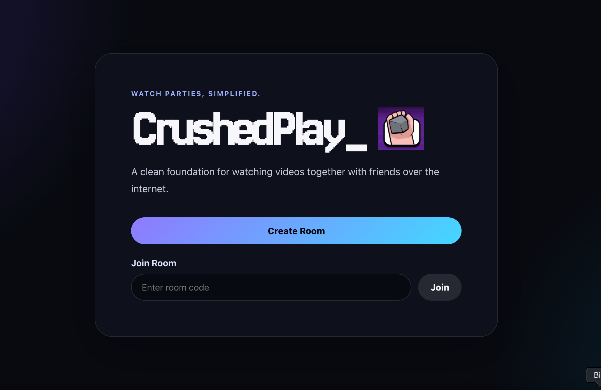
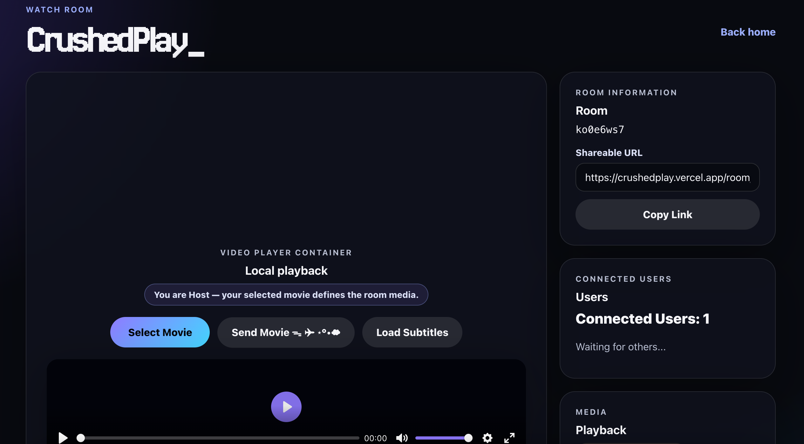

# CrushedPlay_

CrushedPlay_ is a fully-synchronized peer-to-peer watch party application. It allows you to watch local video files together with friends over the internet in perfect synchronization. 

Instead of requiring everyone to download the same file manually beforehand, CrushedPlay_ uses WebRTC to stream the movie directly from the Host to the Guest's local Origin Private File System (OPFS), bypassing RAM limits entirely and enabling smooth, synchronized playback of massive HD video files.

## How to Use

1. **Create a Room:** Head to the homepage and click "Create Room".
   
   

2. **Share the Link:** Copy the room URL and share it with your friend.
3. **Host Selects Movie:** As the host, click "Select Movie" and choose your video file.
4. **Send the Movie:** Click Send Movie. The file will rapidly stream to your friend using a P2P WebRTC connection.
5. **Watch Together:** Once the progress bar completes and the file is verified, simply hit play. You're now watching perfectly in sync!

   

---

## Technical Architecture

CrushedPlay_ is composed of a decoupled Frontend (Vercel) and Backend (Render). 

### 1. The Backend (Signaling & Sync Server)
- **Deployment:** Render (`crushedplay-api.onrender.com`)
- **Stack:** Node.js + Express + `ws` (WebSockets)
- **Role:** The backend acts purely as a signaling and synchronization hub. It holds **zero** media files. 
- **Communication:** When a user interacts with their video player (Play, Pause, Seek), the frontend sends a tiny WebSocket payload to the Render backend, which instantly broadcasts it to all other users in the room to keep the `video.currentTime` in perfect sync.

### 2. The Frontend (Client)
- **Deployment:** Vercel (`crushedplay.vercel.app`)
- **Stack:** React + Vite + TypeScript
- **Role:** Handles the UI, the WebRTC DataChannel streaming, and the actual media playback pipeline using `Plyr`.

### 3. The WebRTC / OPFS Pipeline
When the Host clicks "Send Movie", the Vercel frontend does NOT upload the file to a server. Instead:
1. **Signaling:** The Host and Guest exchange WebRTC SDP Offers and ICE candidates over the Render WebSocket server to punch through their NAT/firewalls.
2. **DataChannel Streaming:** A direct Peer-to-Peer connection is established. The Host slices the video file into 64KB chunks and sends them over the RTCDataChannel.
3. **OPFS Streaming:** The Guest receives these chunks and streams them directly into the browser's **Origin Private File System (OPFS)** sandbox on their hard drive. This entirely bypasses the browser's RAM limits, meaning a 5GB 4K movie can be transferred without crashing the tab.
4. **Fingerprint Verification:** Once the transfer finishes, the Guest computes a partial SHA-256 fingerprint (first 4MB) to mathematically guarantee the file wasn't corrupted in transit.
5. **Local Mounting:** The verified OPFS `File` object is handed to the local media player, and synchronized playback begins!

---

## Fun Facts & Bug Logs 🐛

Building CrushedPlay_ pushed me deep into browser internals, WebRTC, and some surprisingly obscure edge cases. Here are a few of my favourite bugs that surfaced during development.

### 🎬 Face/Off

When both the Host and Guest tried to establish the WebRTC tunnel simultaneously, their SDP Offers crossed paths in the signaling server and resulted in a race condition. The connection deadlocked and the Guest never received the movie.

> [!TIP]
> **Solution:** I enforced strict peer roles. The Host became the sole **Caller**, responsible for creating the DataChannel and SDP Offer, while the Guest always acted as the **Answerer**. This completely eliminated offer collisions.

---

### 🎭 Being John Malkovich

After a successful movie transfer, the Guest UI suddenly crashed with:

`NotFoundError: Failed to execute 'insertBefore' on 'Node'`

**What happened?**  
`Plyr` aggressively replaces and restructures the original `<video>` element by wrapping it in its own DOM hierarchy. React then attempted to insert the progress UI beside an element that no longer existed where it expected.

> [!TIP]
> **Solution:** I isolated all React-controlled controls inside a stable wrapper `
`, preventing React's Virtual DOM from interfering with `Plyr`'s direct DOM manipulations.

---

### 🔇 A Quiet Place

If the Guest simply waited for a large movie transfer to finish without interacting with the page, synchronized playback silently failed.

**What happened?**  
Modern browsers block autoplay unless the user has interacted with the page. The Guest's `video.play()` call was rejected with a `NotAllowedError`.

> [!TIP]
> **Solution:** The application now catches the rejected promise and displays a large **"Click to Sync & Play"** overlay. One click satisfies the browser's autoplay policy and immediately resumes synchronized playback.

---

### 🐜 Ant-Man

After deployment, the frontend couldn't communicate with the backend even though the production origin had been whitelisted.

**What happened?**  
The CORS whitelist contained:

`https://crushedplay.vercel.app/`

Notice the trailing slash.

Browsers send:

`https://crushedplay.vercel.app`

Because the origin comparison is an exact string match, that single `/` caused every request to fail.

> [!TIP]
> **Solution:** Deleted one character.
